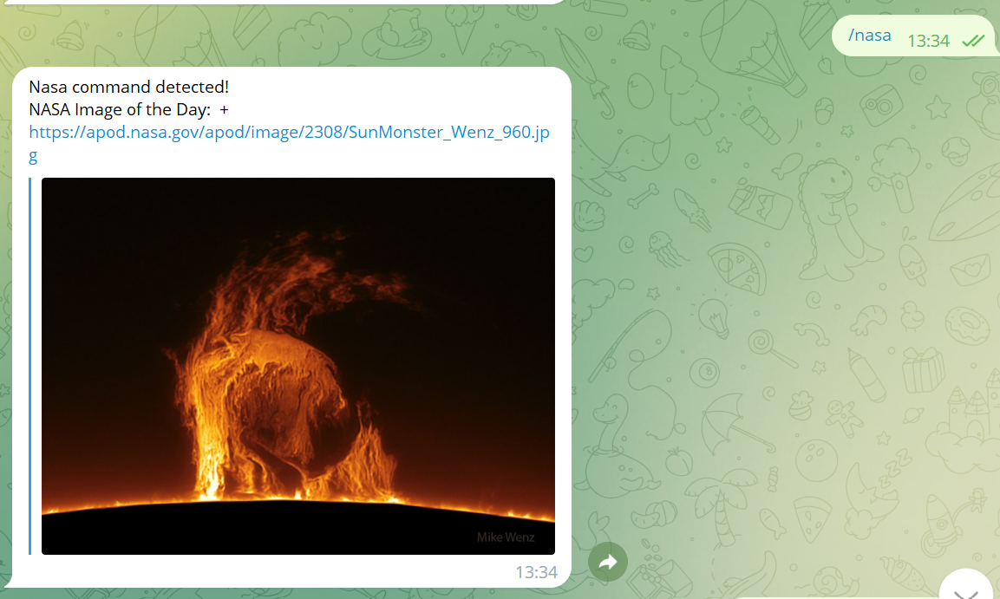
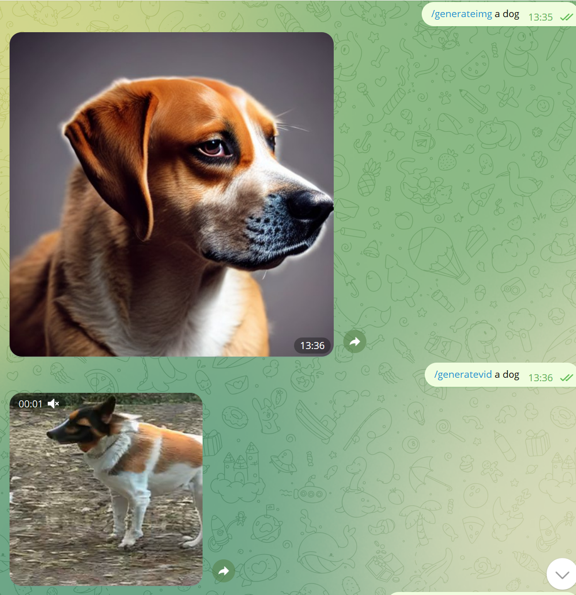
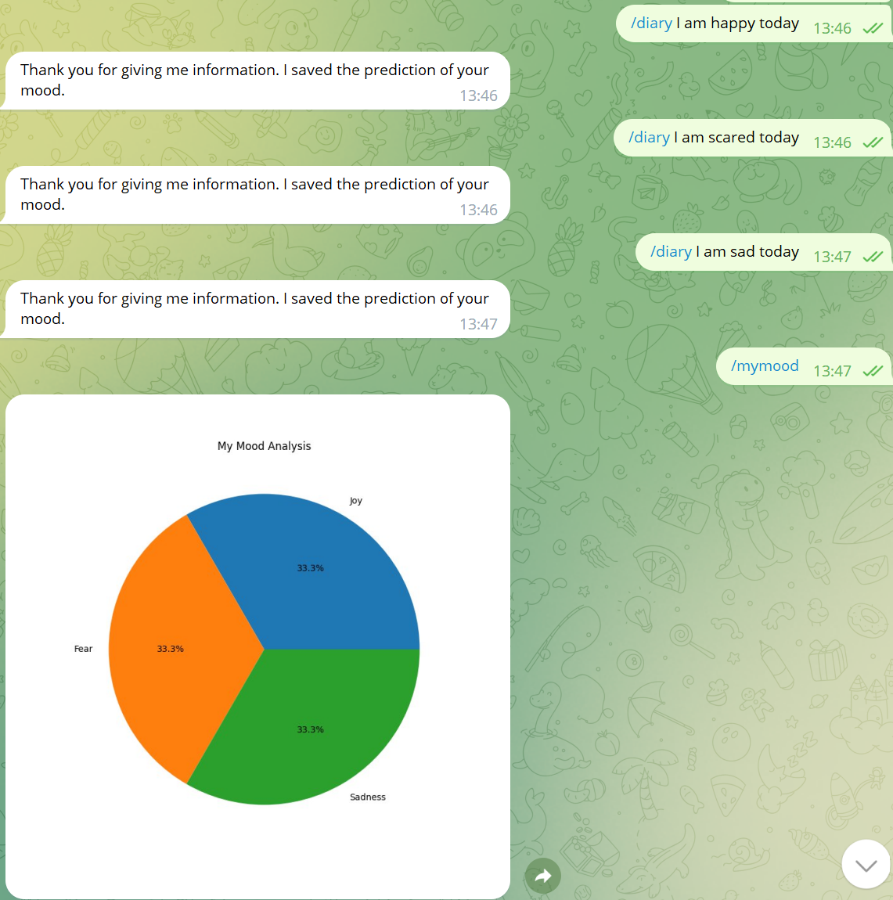

# Telegram-ChatBot-with-Sentiment-Analysis

A versatile Telegram bot with AI capabilities, capable of generating images and videos from text, connecting to OpenAI's ChatGPT, fetching news, sentiment analysis, and more!

## Table of Contents
- [Overview](#overview)
- [Installation](#installation)
- [Usage](#usage)
- [Commands](#commands)
- [Contributing](#contributing)

## Overview

This Telegram bot is designed to provide a range of exciting and useful functionalities to its users. It integrates several AI models and APIs to generate images, videos, and use sentiment analysis. Additionally, it can fetch news, connect to ChatGPT for interactive chat, and even store and visualize mood data.

## Installation

1. Clone the repository:

   ```bash
   git clone https://github.com/g-hano/Telegram-ChatBot-with-Sentiment-Analysis.git
   ```

2. Install the required dependencies:

   ```bash
   pip install -r requirements.txt
   ```

3. Set up necessary API keys:

   - Get API keys for Hugging Face, NASA, newsapi, and OpenAI's GPT-3 API.
   - Fill the keys in tokens.py file:

   ```
   HUGGINGFACE_TOKEN=your_hugging_face_api_token
   NASA_API_KEY=your_nasa_api_key
   NEWSAPI_API_KEY=your_newsapi_api_key
   OPENAI_API_KEY=your_openai_gpt3_api_key
   ```

## Usage

1. Run the bot:

   ```bash
   python main.py
   ```

2. Open Telegram and search for your bot. Start a chat with it.

3. Use the available commands (see [Commands](#commands)) to interact with the bot and explore its features.

## Commands

Here's a list of available commands:

- `/start`: Start the bot.
- `/help`: See the list of available commands.
- `/nasa`: Get the daily photo from NASA API. 
- `/generateimg`: Generate an image from text using the Hugging Face texttoimage pretrained model.
- `/generatevid`: Generate a video from text using the Hugging Face texttovidoe pretrained model.
- `/askgpt`: Use OpenAI's ChatGPT to answer your messages.
- `/news`: Get news for specific topics, use `/help` command for detailed info.
- `/diary`: Write down your day, and the machine learning model will understand your mood and store the data.
- `/mymood`: See your stored mood data.


## Contributing

Contributions are welcome! If you have any suggestions, bug fixes, or new features to add, please create a pull request.
